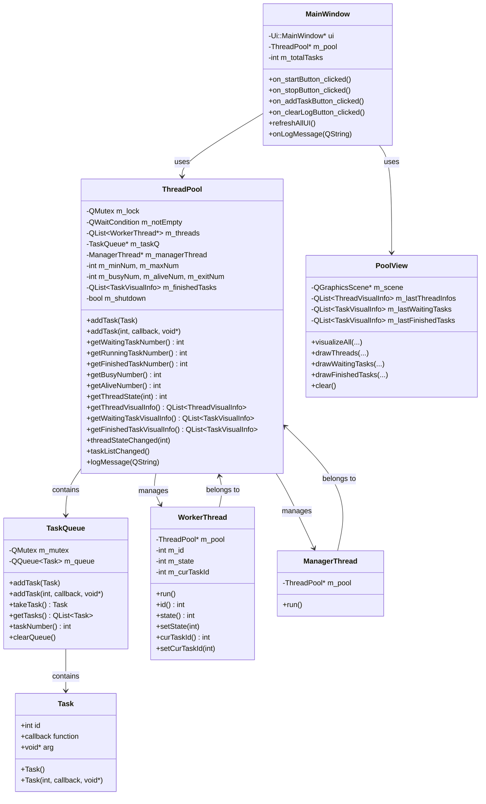
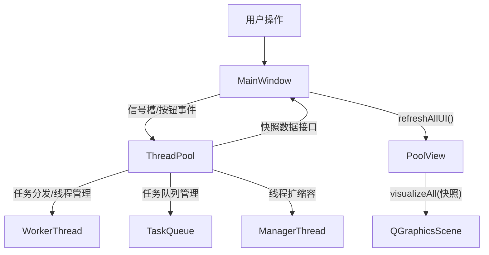
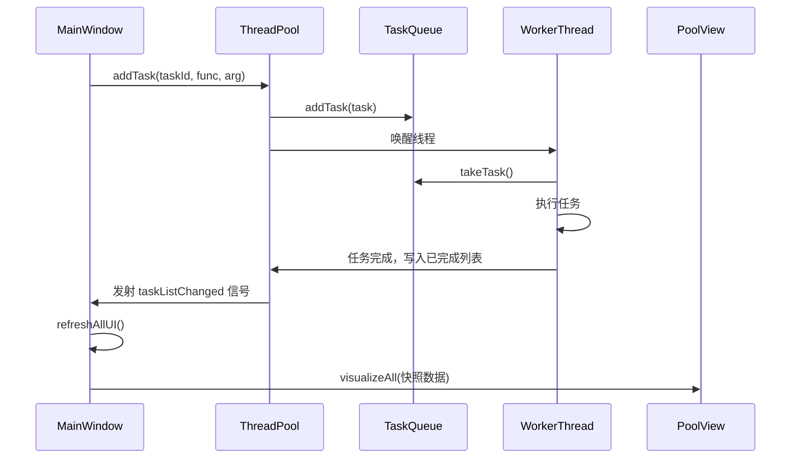
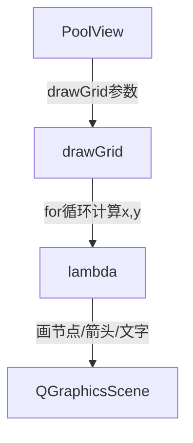
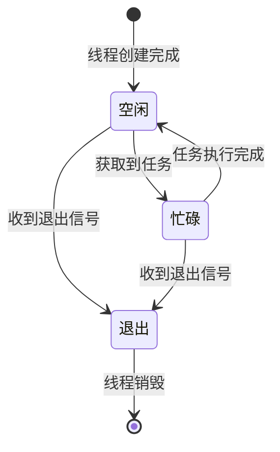

# Qt6 线程池可视化系统

---

## 项目概述

本项目是一个基于 Qt6/C++17 的线程池系统，支持动态线程管理、任务调度、线程安全和专业级可视化界面。  
采用信号槽机制实现线程池与 UI 的彻底解耦，所有可视化区域（等待队列、线程池、已完成任务）均采用统一网格布局，支持自动换行、居中、紧凑排列，适合多线程任务并发处理、教学演示和工程实践。

---

## 功能特性

- **动态线程管理**：支持最小/最大线程数配置，自动扩容和缩容
- **任务队列管理**：支持任务添加、执行、清空等操作
- **实时状态监控**：可视化显示线程状态、任务队列、已完成任务、统计信息、运行日志
- **线程安全**：QMutex/QWaitCondition 保护所有共享资源
- **信号槽机制**：UI与业务彻底解耦，所有刷新统一由快照数据驱动
- **极简UI刷新**：所有UI刷新逻辑集中在 `refreshAllUI()`，避免多处维护和数据不同步
- **代码极简复用**：PoolView 内部所有区域统一用 drawGrid 网格函数，极大减少重复代码

---

## 设计亮点

- **字段分离，职责单一**  
  - `totalTimeMs` 只在 `Task`/`TaskVisualInfo` 结构体中，表示任务的总耗时，是任务的固有属性。
  - `curTimeMs` 只在 `WorkerThread`/`ThreadVisualInfo` 结构体中，表示线程当前正在执行任务的已耗时，是线程的动态状态。
  - 这样分离让数据结构更清晰，避免冗余和同步问题，便于维护和扩展。

- **进度条动画与任务同步**  
  - WorkerThread 采用分段 sleep 并定期更新 curTimeMs，UI 进度条动画与任务实际完成严格同步。
  - 任务函数不再 sleep，避免进度条提前走完但任务未完成的现象。

- **UI与业务彻底解耦**  
  - UI 只依赖快照数据（`ThreadVisualInfo`、`TaskVisualInfo`），不直接依赖 ThreadPool 对象。
  - 进度条绘制时通过 curTaskId 查找 totalTimeMs，结构职责分明。

- **高效查找与可扩展性**  
  - MainWindow 维护 `QMap<int, int>` 作为 taskId 到 totalTimeMs 的映射，PoolView 通过 map 实时查找任务总耗时，查找效率高。
  - 便于后续调度算法扩展和维护。

---

## 项目结构

```
ThreadPool/
├── main.cpp                 # 程序入口
├── mainwindow.cpp/h/ui      # 主窗口及UI
├── poolview.cpp/h           # 可视化区域（自定义QGraphicsView）
├── threadpool.cpp/h         # 线程池核心
├── taskqueue.cpp/h          # 任务队列
├── visualinfo.h             # 可视化快照结构体
└── ThreadPool.pro           # Qt项目文件
```

---

## 软件设计图

### 1. 类图



---

### 2. 数据流图



---

### 3. 线程池任务调度序列图



---

### 4. PoolView 网格绘制原理



---

### 5. 线程状态转换图



---

## UI界面说明

- 左侧为任务队列、线程状态、统计信息，宽度固定
- 右侧为线程池可视化区域，随窗口拉伸自适应
- 所有任务、线程、已完成任务均以图形方式直观展示
- PoolView 区域自动换行、居中、紧凑排列，风格统一

---

## 主要流程与原理

- **UI刷新统一入口**：所有UI刷新逻辑集中在 `refreshAllUI()`，只依赖线程池快照数据，避免多处维护和数据不同步。
- **线程池快照接口**：UI 通过 `getThreadVisualInfo()`、`getWaitingTaskVisualInfo()`、`getFinishedTaskVisualInfo()` 获取线程、任务、已完成任务的快照，UI与业务彻底解耦。
- **PoolView极简复用**：所有可视化区域统一用 drawGrid 网格函数，布局、间距、居中、换行等逻辑高度复用，每个区域只需传入节点参数和lambda，专注自身内容。
- **字段分离**：`totalTimeMs` 只在任务相关结构体，`curTimeMs` 只在线程相关结构体，避免冗余和同步问题。
- **进度条动画**：WorkerThread 分段 sleep 并定期更新 curTimeMs，UI 进度条动画与任务实际完成严格同步。
- **UI查找总耗时**：PoolView 画线程进度条时，用 curTaskId 查找 MainWindow 维护的 QMap<int, int>，获取 totalTimeMs。
- **任务函数不再 sleep**：所有耗时模拟和进度条动画都由 WorkerThread 控制，任务函数只做业务逻辑或为空。

---

## 编译与运行

- 环境要求：Qt 6.x，C++17 及以上
- 用 Qt Creator 打开 `ThreadPool.pro`，编译并运行即可

---

## 扩展建议

- 支持任务优先级、任务取消/暂停
- 增加任务/线程动画效果
- 支持多线程池、分组显示
- 性能监控、异常处理、配置持久化

---

## 结语

本项目通过极简、优雅的架构实现了线程池与UI的彻底解耦，所有可视化区域高度复用，代码易读易扩展。  
适合教学、演示和实际工程使用，欢迎二次开发和贡献！

---