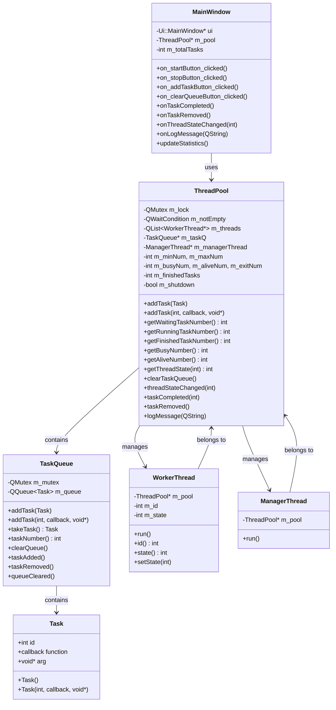
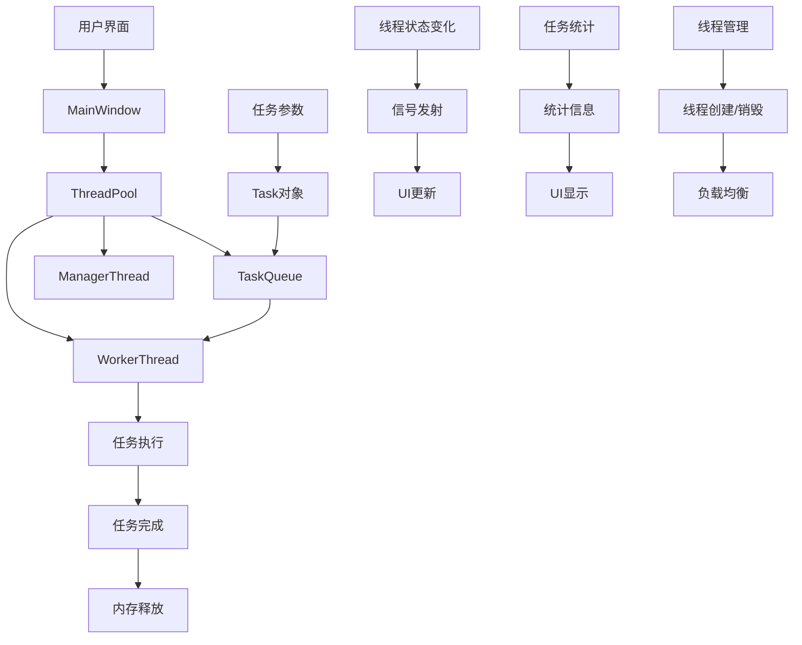
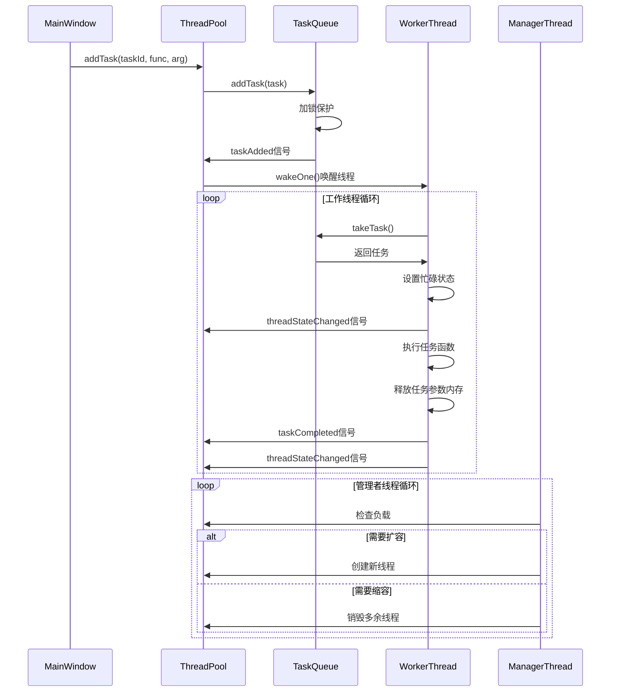
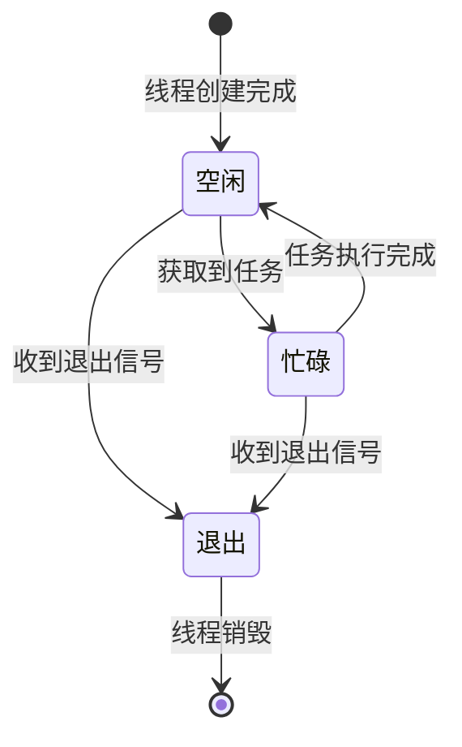
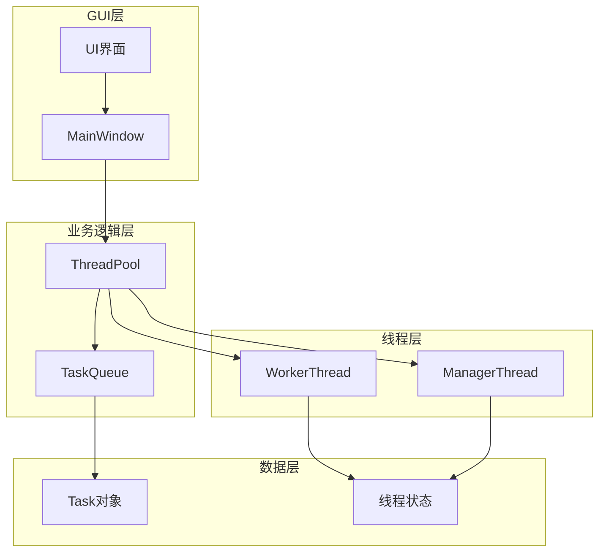

---

# Qt线程池项目文档

## 项目概述

本项目是一个基于Qt框架实现的线程池系统，支持动态线程管理、任务调度、线程安全和可视化界面。采用Qt信号槽机制实现线程池与UI的实时联动，适合多线程任务并发处理和教学演示。

---

## 功能特性

- **动态线程管理**：支持最小/最大线程数配置，自动扩容和缩容
- **任务队列管理**：支持任务添加、执行、清空等操作
- **实时状态监控**：可视化显示线程状态、任务队列、运行日志
- **线程安全**：使用Qt的互斥锁和条件变量保证线程安全
- **信号槽机制**：线程池与UI解耦，支持跨线程通信

---

## 项目结构

```
ThreadPool/
├── main.cpp                 # 程序入口
├── mainwindow.cpp           # 主窗口实现
├── mainwindow.h             # 主窗口头文件
├── mainwindow.ui            # 主窗口UI设计文件
├── threadpool.cpp           # 线程池核心实现
├── threadpool.h             # 线程池头文件
├── taskqueue.cpp            # 任务队列实现
├── taskqueue.h              # 任务队列头文件
└── ThreadPool.pro           # Qt项目文件
```

---

## 软件设计图

### 1. 类图



---

### 2. 数据流图



---

### 3. 序列图（任务执行流程）



---

### 4. 状态图（线程状态转换）



---

### 5. 组件图



---

## 线程状态管理

- **0**：空闲（等待任务）
- **1**：忙碌（执行任务）
- **-1**：退出（线程已销毁）

状态流转：  
`创建线程 → 空闲(0) → 忙碌(1) → 空闲(0) → 退出(-1)`

---

## 动态线程管理

- **扩容**：任务数 > 存活线程数 且 存活线程数 < 最大线程数，每次最多创建2个线程，每5秒检查一次
- **缩容**：忙线程数 × 2 < 存活线程数 且 存活线程数 > 最小线程数，每次最多销毁2个线程

---

## 使用方法

1. 设置最小/最大线程数，点击“开始”启动线程池
2. 点击“添加任务”生成并添加任务
3. 实时监控线程状态、任务队列、统计信息和日志
4. 点击“清空队列”可清空等待任务
5. 点击“停止”安全关闭线程池

---

## 技术特点

- **线程安全**：QMutex/QWaitCondition保护共享资源
- **信号槽机制**：UI与线程池解耦，支持跨线程通信
- **性能优化**：延迟信号发射、智能线程管理
- **用户体验**：实时状态更新、可视化界面、详细日志

---

## 编译运行

- Qt 6.x，C++17及以上
- 用Qt Creator打开 `ThreadPool.pro`，配置编译环境，点击运行

---

## 扩展建议

- 支持自定义任务函数、任务优先级、任务取消/暂停
- 性能监控图表、配置持久化、异常处理、内存管理优化、多线程池支持

---

## 总结

本项目展示了Qt在并发编程中的强大能力，通过信号槽机制实现了线程池与UI的高效结合。代码结构清晰，功能完整，易于扩展和维护。

---