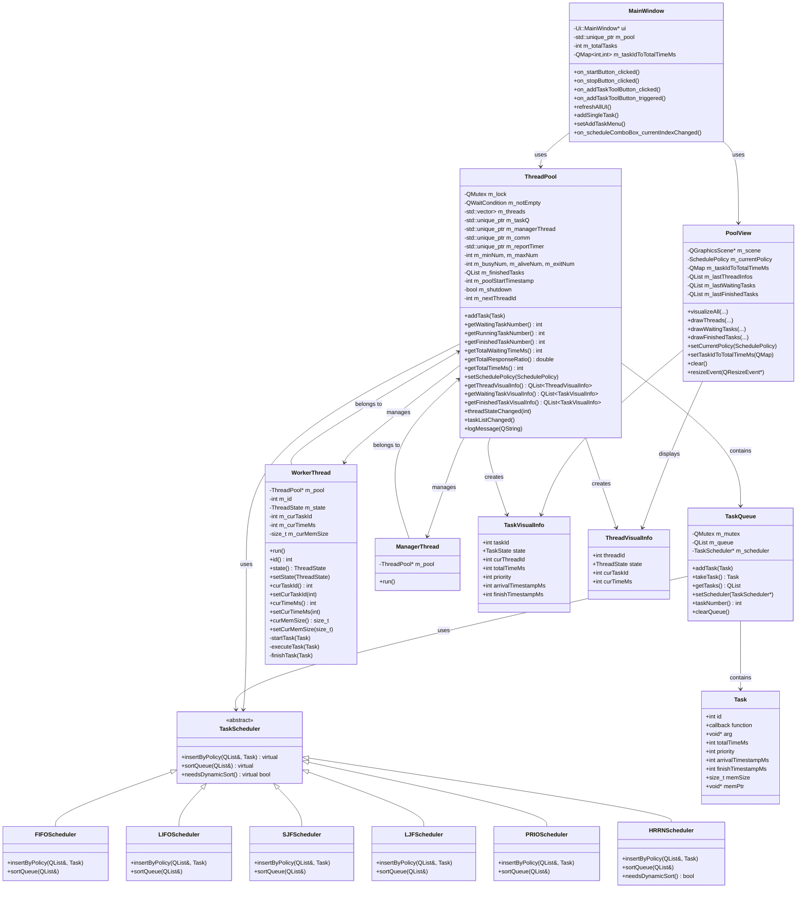
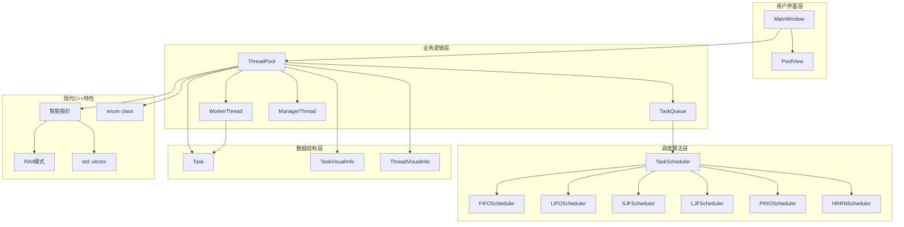
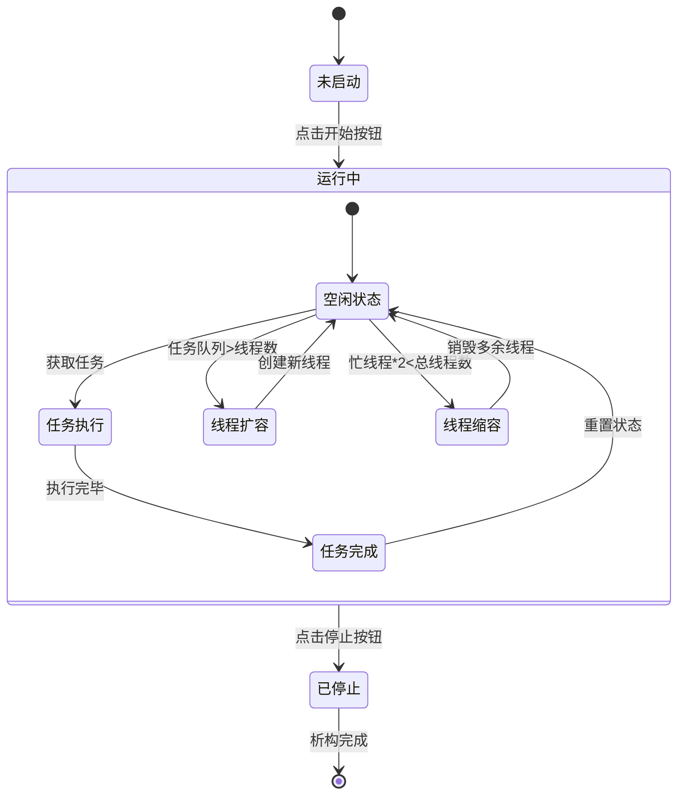
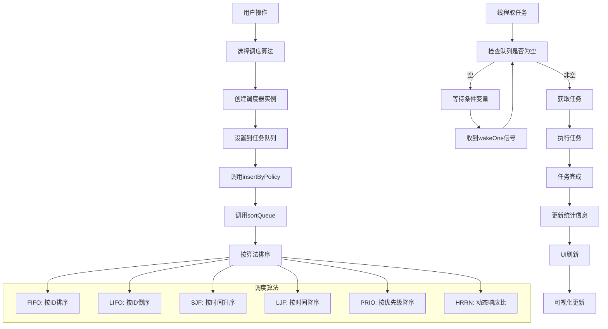
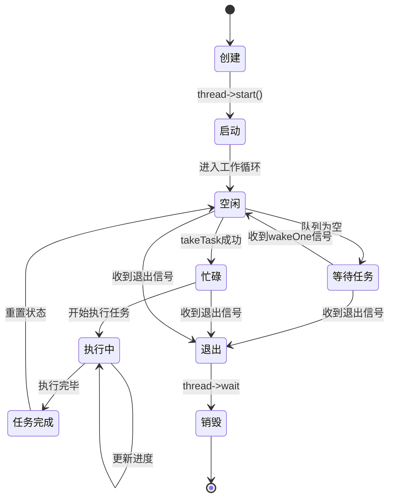
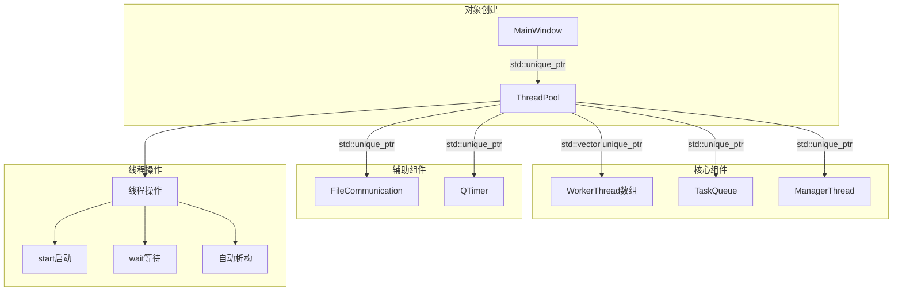

# Qt6 线程池可视化系统

---

## 项目概述

本项目是一个基于 Qt6/C++17 的线程池系统，支持动态线程管理、多种任务调度算法、实时性能监控和专业级可视化界面。  
采用信号槽机制实现线程池与 UI 的彻底解耦，支持6种经典调度算法（FIFO、LIFO、SJF、LJF、PRIO、HRRN），具备完整的性能指标统计和优雅的可视化展示。

---

## 功能特性

### 核心功能
- **动态线程管理**：支持最小/最大线程数配置，自动扩容和缩容
- **多算法调度**：支持6种经典任务调度算法
- **任务队列管理**：支持单任务/批量任务添加，支持间隔添加
- **实时状态监控**：可视化显示线程状态、任务队列、已完成任务
- **性能指标统计**：平均等待时间、平均响应比、吞吐量、CPU利用率

### 调度算法
- **FIFO（先进先出）**：按任务ID排序，先到先服务
- **LIFO（后进先出）**：按任务ID倒序，后到先服务
- **SJF（短作业优先）**：按执行时间升序，短任务优先
- **LJF（长作业优先）**：按执行时间降序，长任务优先
- **PRIO（优先级优先）**：按优先级降序，高优先级优先
- **HRRN（最高响应比优先）**：动态计算响应比，防止饥饿

### 技术特性
- **现代C++17**：全面使用智能指针和RAII模式
- **智能内存管理**：std::unique_ptr自动管理所有动态对象
- **高性能容器**：std::vector替代Qt容器，提升性能和兼容性
- **线程安全**：QMutex/QWaitCondition 保护所有共享资源
- **信号槽机制**：UI与业务彻底解耦，所有刷新统一由快照数据驱动
- **优雅架构**：虚函数实现调度器多态，代码结构清晰
- **动态排序**：HRRN算法支持实时重新排序，响应比随时间动态变化
---


## 设计亮点

### 1. 现代C++架构设计
- **智能指针管理**：std::unique_ptr管理所有动态对象，实现RAII自动内存管理
- **高性能容器**：std::vector替代Qt容器，解决兼容性问题，提升性能
- **类型安全**：enum class替代魔法数字，编译时类型检查
- **异常安全**：智能指针确保异常时资源自动释放

### 2. 智能指针所有权管理
- **先获取信息**：在move之前获取所有必要信息（如线程ID）
- **再转移所有权**：使用std::move转移unique_ptr所有权
- **使用保存信息**：后续操作使用之前保存的信息，避免空指针访问
- **RAII模式**：自动内存管理，无需手动delete

### 3. 调度器架构设计
- **基类抽象**：`TaskScheduler` 基类定义统一接口
- **多态实现**：每种算法独立实现，支持运行时切换
- **虚函数优化**：`needsDynamicSort()` 方法优雅处理动态排序需求
- **代码复用**：`insertByPolicy()` 调用 `sortQueue()` 减少重复代码

### 4. HRRN算法实现
- **动态响应比**：响应比 = (等待时间 + 服务时间) / 服务时间
- **实时排序**：每次取任务时重新计算和排序
- **防止饥饿**：等待时间越长，响应比越高，优先级越高
- **性能优化**：只对HRRN算法重新排序，其他算法保持静态排序

### 5. 性能指标系统
- **平均等待时间**：Σ(完成时间 - 到达时间) / 已完成任务数
- **平均响应比**：Σ(各任务响应比) / 已完成任务数
- **吞吐量**：已完成任务数 / 线程池运行时间
- **CPU利用率**：(忙碌线程数 / 总线程数) × 100%

### 6. 任务添加优化
- **QToolButton设计**：单按钮支持单击和下拉菜单
- **批量添加**：支持5个、10个、20个任务快速添加
- **间隔添加**：支持自定义间隔时间，模拟真实任务到达
- **优雅实现**：使用 `QTimer::singleShot` 避免UI阻塞

### 7. 数据结构设计
- **字段分离**：`totalTimeMs` 在任务结构体，`curTimeMs` 在线程结构体
- **时间戳统一**：使用 `QTime::currentTime().msecsSinceStartOfDay()` 统一时间处理
- **快照机制**：UI只依赖快照数据，与业务逻辑彻底解耦

---

## 项目结构


```
ThreadPool/
├── main.cpp # 程序入口
├── mainwindow.cpp/h/ui # 主窗口及UI，性能指标计算
├── poolview.cpp/h # 可视化区域（自定义QGraphicsView）
├── threadpool.cpp/h # 线程池核心，性能指标统计
├── taskqueue.cpp/h # 任务队列，调度器集成
├── scheduler.cpp/h # 调度算法实现
├── visualinfo.h # 可视化快照结构体
└── ThreadPool.pro # Qt项目文件
```

---

---

## 软件设计图

### 1. 完整类图



### 2. 系统架构图




### 3. 线程池生命周期图



### 4. 任务调度流程图




### 5. HRRN算法详细流程图


### 6. 性能指标计算详细图


### 7. UI数据流图


### 8. 线程状态转换详细图



### 9. 调度算法比较图


### 10. 智能指针内存管理图




### 11. 信号槽连接图


### 12. 可视化布局图


---

## UI界面说明

### 主要区域
- **线程池配置区**：线程数设置、调度算法选择、开始/停止按钮
- **任务添加区**：QToolButton支持单击添加单任务，下拉菜单支持批量添加
- **统计信息区**：线程状态、任务状态、性能指标（平均等待时间、响应比、吞吐量、CPU利用率）
- **任务队列区**：等待执行、正在执行、已完成任务列表
- **线程状态区**：工作线程、空闲线程列表
- **可视化区**：PoolView图形化展示线程池状态
- **运行日志区**：实时日志输出

### 可视化特性
- **等待队列**：圆角矩形，红色边框，显示任务ID和相关信息
- **线程池**：矩形进度条，绿色表示已完成，红色表示未完成
- **已完成任务**：圆角矩形，绿色边框，显示任务ID和执行线程
- **HRRN显示**：等待任务显示响应比(hr值)，实时更新

---

## 主要流程与原理

### 1. 调度算法切换
```cpp
// 运行时切换调度算法
m_pool->setSchedulePolicy(static_cast<SchedulePolicy>(index));
// 自动重新排序现有队列
m_scheduler->sortQueue(m_queue);
```

### 2. HRRN动态排序
```cpp
// 每次取任务前重新排序
if (m_scheduler && m_scheduler->needsDynamicSort()) {
    m_scheduler->sortQueue(m_queue);
}
```

### 3. 性能指标计算
```cpp
// 平均等待时间
avgWaitingTimeS = totalWaitingTimeMs / finishedTasks / 1000.0;

// 平均响应比
avgResponseRatio = totalResponseRatio / finishedTasks;

// 吞吐量
throughput = finishedTasks / (totalTimeMs / 1000.0);

// CPU利用率
cpuUtilization = (busyThreads / totalThreads) * 100.0;
```

### 4. 批量任务添加
```cpp
// 使用QTimer::singleShot实现间隔添加
for (int i = 1; i < count; ++i) {
    QTimer::singleShot(interval * i, this, [this]() {
        if (m_pool) {
            addSingleTask();
        }
    });
}
```

---

## 编译与运行

### 环境要求
- Qt 6.x
- C++17 及以上
- 支持多线程

### 编译步骤
1. 用 Qt Creator 打开 `ThreadPool.pro`
2. 配置编译环境
3. 编译并运行

### 使用说明
1. 设置线程数范围和调度算法
2. 点击"开始"启动线程池
3. 使用"添加任务"按钮添加任务
4. 观察实时统计信息和可视化效果
5. 可随时切换调度算法观察不同效果

---

## 扩展建议

### 功能扩展
- 更多调度算法：时间片轮转（RR）、多级反馈队列（MLFQ）
- 任务管理：取消、暂停、恢复
- 负载优化：优先级动态调整、负载均衡
- 监控增强：执行时间分布、队列长度/趋势图

### 技术优化
- 异常处理：任务回退与错误恢复
- 配置持久化：保存/加载线程池与调度设置
- 日志系统：结构化日志与日志级别
- 单元测试：调度与并发路径的覆盖

---

## 结语

本项目成功实现了6种经典调度算法，特别是HRRN算法的动态排序特性，具备完整的性能监控和优雅的可视化界面。  
通过虚函数设计实现了调度器的优雅扩展，通过信号槽机制实现了UI与业务逻辑的彻底解耦。  
代码结构清晰，易于理解和扩展，适合教学演示和实际工程使用。  
欢迎二次开发和贡献！

---